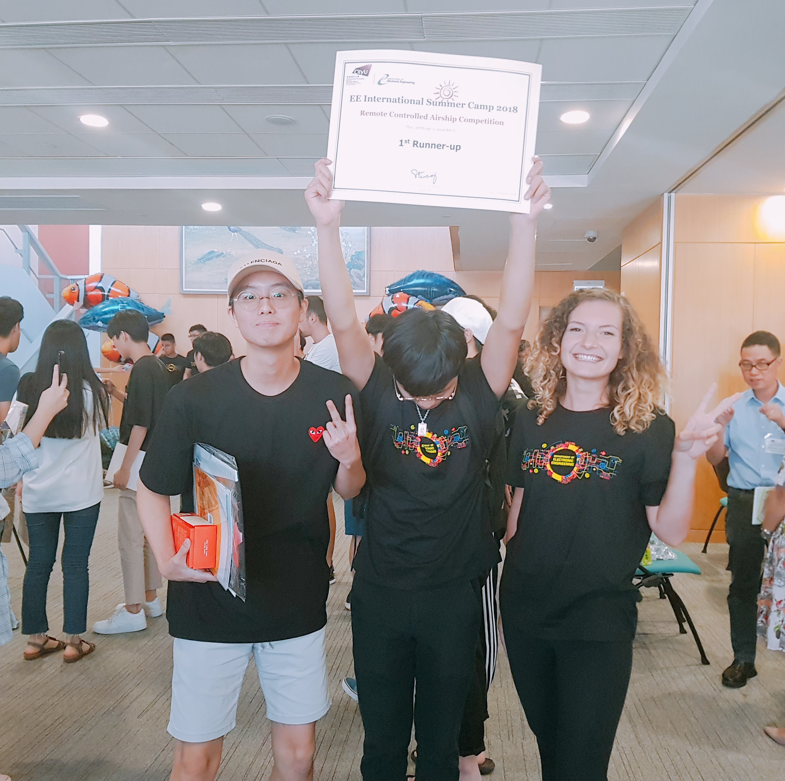
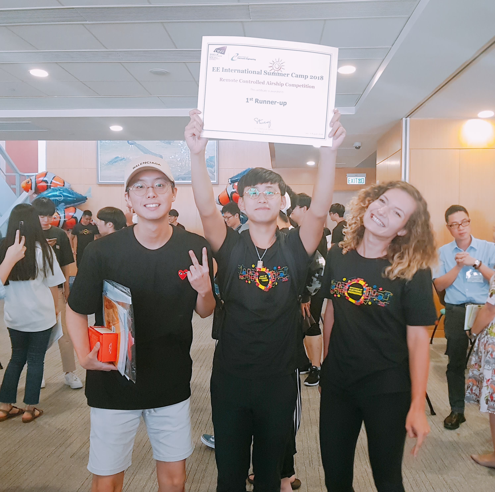

Champion
===
Thanks for everyone here, we have achieved this ~~~

CityU Fish Craft
===

2018/7 ~ 8 I had been CityU HK as an exchange student for about a month.
Here I have done a project which contain a fish swimming in the sky, and mobile application for controlling the fish, most important I got lots of new friend here that I will never forget.

3D printer 
---
My parner Chang Yoon take care of this part. And he did really great, which makes our fish operating outstanding.
(As a "pure" engineer I guess only programming is able to get me addicted, So I decided to keep my attention on programming ~~)

Arduino
---
**sketch_jul17a.ino**
class **Motor** is a module for motor operating. The contructor set up the pin of each motor and private function take care of the hardware sensitive setting, such as PWM, Direction .. etc. In this case, I hope to make sure, the sensitive setting won't get borthered. 

After Motors get set well. I have done some global function for controlling the fish. Such as :
Maintain() : keep left and right motors in the same rate
ReverseMaintain() : inverse the direction and Maintain()
LeftWard():
RightWard():
ForWard():
BackWard():
UpWard():
BackWard():

In this design, I can controll the hardward in an easy way without thinking complicated stuff ~~

Android Application
---
In this part, I have set up the basic GUI, functional Code, (And my parner make GUI more beautiful afterward, Thanks them)

**mobile/FishController**
in order to explain the .java code , Let me give the background
* Transport with BLE (Bluetooth low energy)
  * So got to set up Bluetooth Adapter (Thanks for czech friend toturail ^^)
  * Here I just connect to fish simply by MAC-address
  * The application still provide the function to scan the devices arround us
* sending a byte for controlling code
  * as know, 1 byte(8 bits)
  * first 4 bit represent the status code of height controlling
    * 0001 represent upward
    * 0100 represent downward
    * 0000 represent shut it down
  * later 4 bit represent forward, backward, leftward, rightward
    * 1000 : forward
    * 0100 : backward
    * 0010 : leftward
    * 0001 : rightward

**GUI**
There're 7 buttons take care of the main functions : 
* Forward
* Backward
* Leftward
* Rightward
* Upward
* Downward
* Shutdown
What I hope is that give users more intuitional experience ><

Afterward, My parner has made GUI looks better, including : style, icon ... etc

Testing
---
After testing, the fish can fly well, Thanks for everybody show up in the stage of my summer trip in CityU, The memory will keep in our mind forever, looking forward for the time we meet again in the future. Ztex

Preliminary Competition
---
We passed the preliminary competition ~~~~~2018.8.6~~~~~

Fasten your seat belt ~ We r taking off ~~

[Ztex 6.8.2018]
